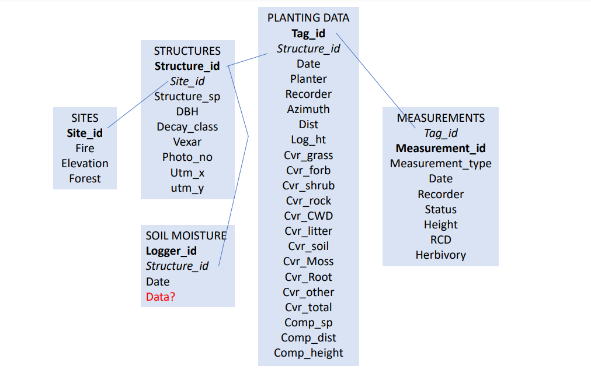

# Building the aspen seedling database 

## Database structure

I will be constructing a database to organize my data. I have roughly 1,000 seedlings planted in four sites under three treatments across the Southwest. For this project, I will follow this database structure. 

```{r diagram, eval = TRUE, echo = FALSE, out.width = '100%', fig.align = 'center', fig.cap = "Diagram illustrating the structure of the database"}

```

## Creating the database 

This is the code we used to create the database. We'll start with loading our packages. I will need 'DBI' and 'RSQLite' packages. I will also download some other packages that might be of use later on.  

```{r pkg, eval = TRUE, echo = TRUE, warning = FALSE, message = FALSE}
library(DBI)
library(RSQLite)
library(ggplot2)
library(tidyverse)
library (lubridate)
```

First, we're going to start by establishing a connection to a SQLite database. 

```{r connection, eval = TRUE, echo = TRUE}
aspen_db <- dbConnect(RSQLite::SQLite())

```

### Creating the measurements table

This table includes all baseline-measurement information about each seedling across all three fire footprints. I do not have information from repeat measurements yet. The table includes columns for tag id, measurement id, date, height of seedlings, root collar diameter of seedlings, site information, recorder information, survivorship status, and herbivory status. The primary key is the measurement id which will reflect when the measurement was done. 

```{r measurments-table, eval = FALSE, echo = TRUE}
dbExecute(aspen_db, "CREATE TABLE measurements (
tag_id varchar(4) NOT NULL,
measurement_id varchar (5) NOT NULL,
date varchar (10), 
height varchar (4), 
rcd varchar (4),
site_name varchar, 
structure_id varchar (2),
structure_type varchar (1),
recorder varchar (10), 
status varchar (5),
herbivory varchar (1),
PRIMARY KEY (measurement_id)
);")

measurements <- read.csv("measurements.csv",stringsAsFactors = FALSE)

dbWriteTable(aspen_db, "measuremements", measurements, append = TRUE)
```

### Creating the sites table 

This table includes information about each site within the  three fire footprints. There are four sites total. The table includes columns for fire footprint, site id, elevation, and forest name. The primary key is the fire. 

```{r sites_table, eval = FALSE, echo = TRUE}
dbExecute(aspen_db, "CREATE TABLE sites (
fire varchar (9), 
site_id varchar (1), 
elevation varchar (5), 
forest varchar (16),
PRIMARY KEY (site_id)
);")

sites <- read.csv("sites.csv",stringsAsFactors = FALSE)

dbWriteTable(aspen_db, "sites", sites, append = TRUE)

```

### Creating the soil moisture table 

This table includes information from the soil moisture sensors that will be installed in the Luna fire footprint. There is a column for logger_id, structure_id, and date. The logger id is the primary key. Since I don't know what this data will include and look like, it is empty for now. 

```{r sm_table, eval = FALSE, echo = TRUE}
dbExecute(aspen_db, "CREATE TABLE soil_moisture (
logger_id varchar (10), 
structure_id varchar (3), 
date varchar (10),
PRIMARY KEY (logger_id)
);")

soil_moisture <- read.csv("soil_moisture.csv", stringsAsFactors = FALSE)

dbWriteTable(aspen_db, "soil_moisture", soil_moisture, append = TRUE)

```
### Creating the structures table 

This table includes information about each structure (or treatment) across all three fire footprints. There are columns for site name, site number, structure number, structure type, structure species (applicable for snags and logs), diameter at breast height (applicable for snags), decay class (applicable for snags and logs), vexar, photo number, and the utm coordinates. The primary key will be the photo number since each structure has it's own photo. 

```{r structure_table, eval = FALSE, echo = TRUE}
dbExecute(aspen_db, "CREATE TABLE structures (
site_name varchar, 
site_no varchar (1), 
structure_no varchar (2),
structure_type varchar (1),
structure_sp varchar (5), 
dbh varchar (4), 
decay_class varchar (1), 
vexar varchar (1),
photo_no varchar (6), 
utm_x varchar (15), 
utm_y varchar (15),
PRIMARY KEY (photo_no)
);")

structures <- read.csv("structures.csv", stringsAsFactors = FALSE)

dbWriteTable(aspen_db, "structures", structures, append = TRUE)

```

## Database is complete

Yay! I have successfully created an aspen database. This will not be necessary for my research project moving forward. However, this experience was valuable to help me organize my thoughts and figure out the best way to compartmentalize my data. 
