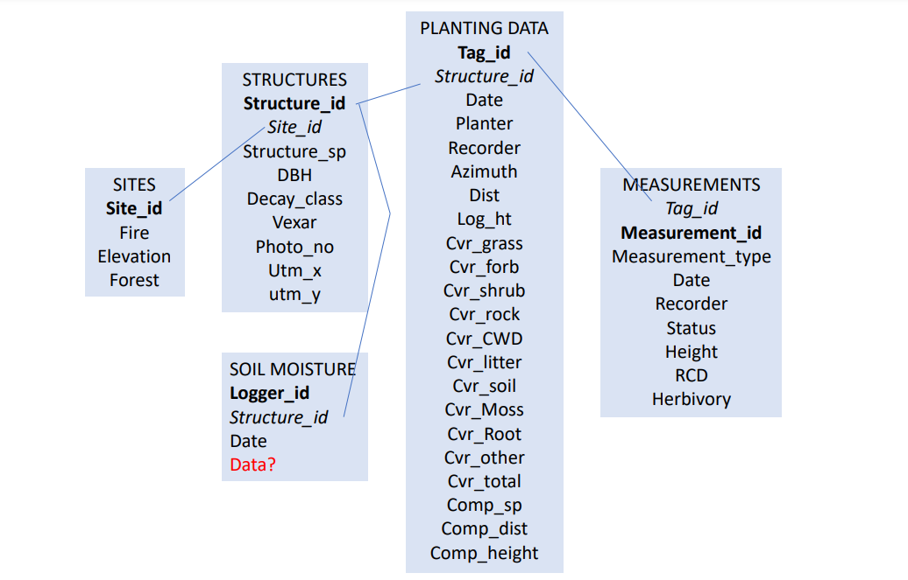

# Building the aspen seedling database 

## Database structure

I will be constructing a database to organize my data. I have roughly 1,000 seedlings planted in four sites under three treatments across the Southwest. For this project, I will follow this database structure

```{r diagram, eval = TRUE, echo = FALSE, out.width = '100%', fig.align = 'center', fig.cap = "Diagram illustrating the structure of the database"}

```

## Creating the database 

This is the code we used to create the database. We'll start with loading the `DBI` and `RSQLite` packages:  

```{r pkg, eval = TRUE, echo = TRUE, warning = FALSE, message = FALSE}
library(DBI)
library(RSQLite)
library(dplyr)
library(ggplot2)
```

First, we're going to start by establishing a connection to a SQLite database. 

```{r connection, eval = TRUE, echo = TRUE}
aspen_db <- dbConnect(RSQLite::SQLite())

```

### Creating the measurments table

This table includes all information about individuals that are part of our dataset. The table includes columns for tag id, measurment id, date, height of seedlings, root collar diameter of seedlings, site information, recorder information, survivorship status, and herbivory status. The primary key is the measurement id. 

```{r measurments-table, eval = FALSE, echo = TRUE}
dbExecute(aspen_db, "CREATE TABLE measurements (
tag_id varchar(4) NOT NULL,
measurement_id varchar (5) NOT NULL,
date varchar (10), 
height varchar (4), 
rcd varchar (4),
site_name varchar, 
structure_id varchar (2),
structure_type varchar (1),
recorder varchar (10), 
status varchar (5),
herbivory varchar (1),
PRIMARY KEY (measurement_id)
);")

measurements <- read.csv("measurements.csv",stringsAsFactors = FALSE)

dbWriteTable(aspen_db, "measuremements", measurements, append = TRUE)

```

### Creating the other tables 

Since creating the first table, I quickly replicated this process for the remaining tables. 

```{r tables, eval = FALSE, echo = TRUE}

# Create planting_data table 

dbExecute(aspen_db, "CREATE TABLE planting_data (
tag_id varchar(4) NOT NULL,
photo_no varchar (6), 
planter varchar (3), 
recorder varchar (10), 
azimuth varchar (5),
dist varchar (5), 
log_ht varchar (5), 
comp_sp varchar (5), 
comp_dist varchar (5), 
comp_ht varchar (5), 
grass varchar (4), 
forb varchar (4), 
rock varchar (4), 
shrub varchar (4), 
cwd varchar (4),
litter varchar (4), 
bare_soil varchar (4), 
moss varchar (4), 
snag varchar (4), 
other varchar (4), 
total varchar (3), 
PRIMARY KEY (tag_id)
);")

planting_data <- read.csv("planting_data.csv",stringsAsFactors = FALSE)

dbWriteTable(aspen_db, "plantind_data", planting_data, append = TRUE)

## Create sites table 

dbExecute(aspen_db, "CREATE TABLE sites (
fire varchar (9), 
site_id varchar (1), 
elevation varchar (5), 
forest varchar (16),
PRIMARY KEY (fire)
);")

sites <- read.csv("sites.csv",stringsAsFactors = FALSE)

dbWriteTable(aspen_db, "sites", sites, append = TRUE)

## Create soil_moisture table 

dbExecute(aspen_db, "CREATE TABLE soil_moisture (
logger_id varchar (10), 
structure_id varchar (3), 
date varchar (10),
PRIMARY KEY (logger_id)
);")

soil_moisture <- read.csv("soil_moisture.csv", stringsAsFactors = FALSE)

dbWriteTable(aspen_db, "soil_moisture", soil_moisture, append = TRUE)

## Create structures table 

dbExecute(aspen_db, "CREATE TABLE structures (
site_name varchar, 
site_no varchar (1), 
structure_no varchar (2),
structure_type varchar (1),
structure_sp varchar (5), 
dbh varchar (4), 
decay_class varchar (1), 
vexar varchar (1),
photo_no varchar (6), 
utm_x varchar (15), 
utm_y varchar (15),
PRIMARY KEY (structure_no)
);")

structures <- read.csv("structures.csv", stringsAsFactors = FALSE)

dbWriteTable(aspen_db, "structures", structures, append = TRUE)
```

# Database is complete

This is the final result of creating our aspen database. 
